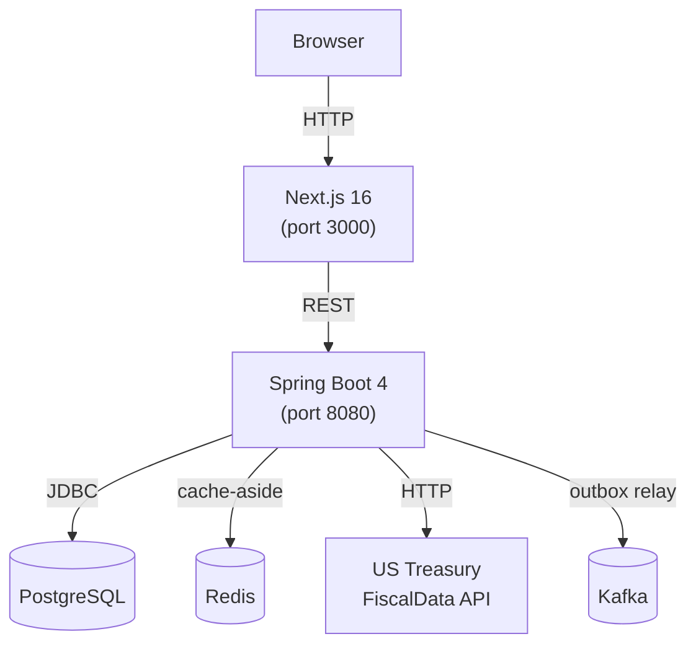

# Expense Tracker

Full-stack reference application for recording USD purchase transactions and retrieving them converted into any currency reported by the [US Treasury Reporting Rates of Exchange](https://fiscaldata.treasury.gov/datasets/treasury-reporting-rates-exchange/treasury-reporting-rates-of-exchange) API.

## Quickstart

**Only prerequisite: Docker.**

```bash
git clone <repo-url>
cd expense-tracker
docker compose up --build
```

| Service    | URL                                          |
|------------|----------------------------------------------|
| Frontend   | <http://localhost:3000>                      |
| Backend    | <http://localhost:8080>                      |
| Swagger UI | <http://localhost:8080/swagger-ui.html>      |
| Health     | <http://localhost:8080/actuator/health>      |

That's it. No local Java, Node, or database setup — everything runs in containers.

> The rest of this document is for developers who want to explore the solution further: running services individually, executing tests, or working on the codebase locally.

## Architecture



**Request flow for currency conversion:**

1. `POST /api/v1/transactions` — stores the purchase and writes an outbox event atomically.
2. An `@Scheduled` relay polls the outbox table and publishes to the `purchase.transactions.created` Kafka topic.
3. `GET /api/v1/transactions/{id}?currency=BRL` — looks up the transaction, checks Redis for a cached FX rate, and on a cache miss calls the Treasury API. The most recent rate with `record_date ≤ transactionDate` and within the prior 6 months is used. Converted amount is `HALF_UP` rounded to 2 dp.

## Stack

- **Backend** — Spring Boot 4 (Spring Framework 7), Java 25, Spring Data JDBC, Flyway, Spring Kafka, Spring Data Redis, Resilience4j circuit-breakers.
- **Frontend** — Next.js 16 (App Router), React 19, TypeScript 6, MSW v2 for development mocks.
- **Storage** — PostgreSQL (`NUMERIC(19,4)` precision) with a transactional outbox pattern.
- **Messaging** — Apache Kafka topic `purchase.transactions.created` driven by the outbox relay.
- **Cache** — Redis cache-aside for FX rates; long TTL since historical rates are immutable.
- **Tests** — JUnit 5 + Testcontainers (Postgres, Kafka, Redis), WireMock for Treasury, Vitest + React Testing Library, Playwright.
- **Tooling** — pnpm workspaces, Turborepo, Gradle 9 (Kotlin DSL), ESLint 9 flat config, Prettier, asdf via `.tool-versions`.

## Repository layout

```
expense-challenge/
├── backend/                  # Spring Boot service (Gradle)
│   └── src/
│       ├── main/
│       │   ├── java/         # com.example.expensechallenge.*
│       │   └── resources/
│       │       ├── application.yml
│       │       ├── currencies.json   # supported ISO 4217 codes
│       │       └── db/migration/     # Flyway SQL migrations
│       └── test/java/        # JUnit 5 + Testcontainers + WireMock
├── packages/
│   ├── api-contract/         # OpenAPI 3.1 spec + generated TS types
│   └── web/                  # Next.js App Router frontend
│       ├── src/
│       │   ├── app/          # Pages, components, SCSS modules
│       │   ├── design-system/# Button, Input, Badge, Modal, …
│       │   ├── lib/          # API client, React Query hooks
│       │   └── mocks/        # MSW handlers + fixtures
│       └── e2e/              # Playwright specs
├── turbo.json
└── pnpm-workspace.yaml
```

## Prerequisites

- [`asdf`](https://asdf-vm.com/) — versions pinned in [`.tool-versions`](.tool-versions) (`nodejs 25.9.0`, `pnpm 11.1.2`, `java openjdk-25`).
- Docker — for Testcontainers and `docker compose up`.

```bash
asdf plugin add nodejs && asdf plugin add pnpm && asdf plugin add java
asdf install
```

## Local development

### Frontend only (no backend needed — uses MSW mocks)

```bash
pnpm install
pnpm dev
```

### Backend only (against docker-compose infra)

Start infra first, then:

```bash
docker compose up -d postgres redis kafka
pnpm backend
```

The `local` Spring profile wires the backend to the docker-compose defaults automatically.

### Frontend against a running backend

```bash
pnpm dev:live
```

## API reference

| Method   | Path                                    | Status | Description                                          |
|----------|-----------------------------------------|--------|------------------------------------------------------|
| `POST`   | `/api/v1/transactions`                  | 201    | Store a purchase transaction                         |
| `GET`    | `/api/v1/transactions`                  | 200    | Paginated ledger (default page 0, size 10)           |
| `GET`    | `/api/v1/transactions/{id}`             | 200    | Retrieve transaction; add `?currency=` to convert    |
| `GET`    | `/api/v1/transactions/{id}?currency=X`  | 422    | No Treasury rate within 6 months of purchase date    |
| `DELETE` | `/api/v1/transactions/{id}/cache`       | 204    | Evict cached FX rates for this transaction's quarter |

All monetary values are `BigDecimal` end-to-end and stored as `NUMERIC(19,4)`. The converted amount is rounded `HALF_UP` to two decimal places at the response boundary.

Error responses follow [RFC 7807](https://www.rfc-editor.org/rfc/rfc7807) (`application/problem+json`).

Full spec: [`packages/api-contract/openapi.yaml`](packages/api-contract/openapi.yaml).

## Supported currencies

10 currencies sourced from the US Treasury Reporting Rates of Exchange:

| Code | Currency              |
|------|-----------------------|
| AUD  | Australia Dollar      |
| BRL  | Brazil Real           |
| CAD  | Canada Dollar         |
| CHF  | Switzerland Franc     |
| CNY  | China Renminbi        |
| EUR  | Euro Zone Euro        |
| GBP  | United Kingdom Pound  |
| INR  | India Rupee           |
| JPY  | Japan Yen             |
| MXN  | Mexico Peso           |

## Useful commands

```bash
pnpm clean        # wipe .next/, generated/ and backend/build/
pnpm generate     # regenerate TS types from openapi.yaml
pnpm lint
pnpm typecheck
pnpm format
```

## Testing

```bash
# Frontend unit + component tests
pnpm test

# Backend (requires Docker for Testcontainers)
pnpm test:backend

# Playwright E2E via Docker Compose (full stack)
# Dedicated compose project so the e2e postgres volume is wiped each run
docker compose -p e2e --profile e2e down -v
docker compose -p e2e --profile e2e run --build --rm e2e

# Playwright E2E (MSW-backed, no backend needed, requires playwright locally)
pnpm test:e2e
```

## License

MIT — see [LICENSE](LICENSE).
